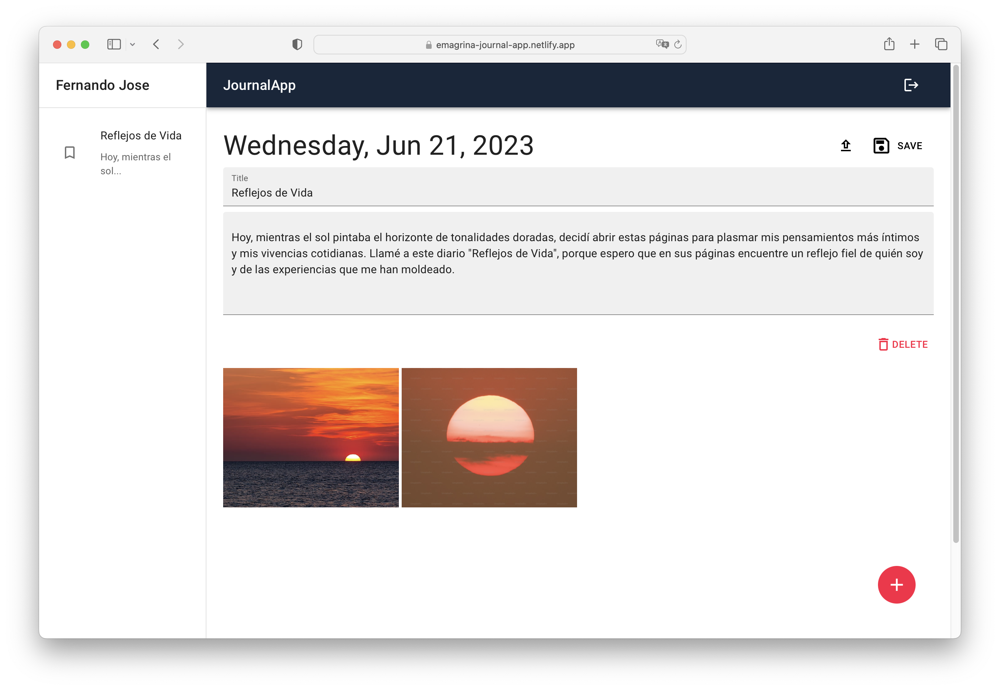
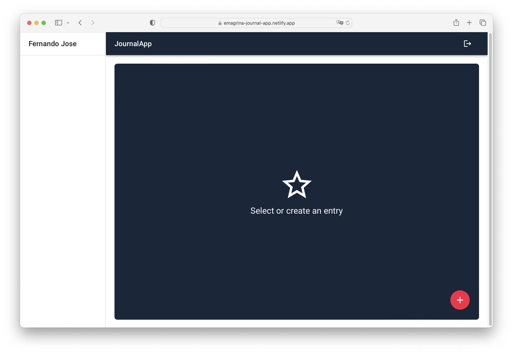
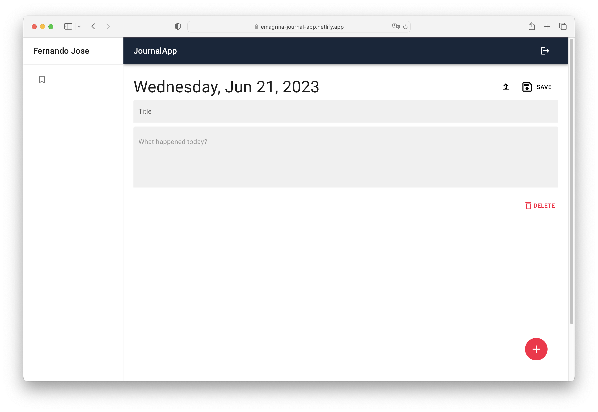

# JournalApp

<a title="LanguagesUsed" target="_blank" href="#">
    
</a>

## Description
The application is a note-taking platform developed using technologies such as React, JavaScript, Redux, Firebase, and Material UI. It allows users to create an account, log in, and authenticate using a Google account. Once authenticated, users can access the note creation interface, where they can add titles, descriptive text, and optionally attach images hosted on Cloudify.


- User Registration and Authentication:
    - Users can create an account by providing a username and password.
    - Users can also authenticate using a Google account.
- Note Creation Interface:
    - Authenticated users can access an intuitive interface for creating notes.
    - They can add a descriptive title to each note.
    - They can write descriptive text for each note.
    - They have the option to attach images to the notes, which are hosted on Cloudify.



## Technologies Used
The application has been developed using the following technologies:

- React: A JavaScript library for building interactive user interfaces.
- JavaScript: A widely used programming language for web development.
- Redux: A state management library that helps maintain application data in a centralized and predictable manner.
- Firebase: A mobile and web app development platform that provides a range of - services, including user authentication and cloud data storage.
- Material UI: A library of pre-styled UI components that facilitates the development of an attractive and consistent user interface.

## Project Setup
Follow these steps to set up the project in your development environment:

1. Clone the project repository from GitHub.
2. Ensure you have Node.js and npm (Node Package Manager) installed on your machine.
3. Open a terminal and navigate to the project's root directory.
4. Run the following command to install project dependencies:
```
yarn install
```
5. Create a Firebase account and set up a project.
6. Obtain the necessary Firebase credentials for authentication and data storage.
7. Create a .env file in the project's root directory and add the Firebase credentials in the following format:

```
REACT_APP_API_KEY=your_api_key
REACT_APP_AUTH_DOMAIN=your_auth_domain
REACT_APP_PROJECT_ID=your_project_id
REACT_APP_STORAGE_BUCKET=your_storage_bucket
REACT_APP_MESSAGING_SENDER_ID=your_messaging_sender_id
REACT_APP_APP_ID=your_app_id
```

8. Start the development server with the following command:
```
yarn dev
```

9. Open your browser and access http://localhost:3000 to see the application in action.

## Conclusion

This documentation provides an overview of the project, its key features, the technologies used, instructions for setting up the project, and its structure. Feel free to modify and customize it according to the project's needs. I hope this information is helpful, and enjoy working on the project!

## Images






